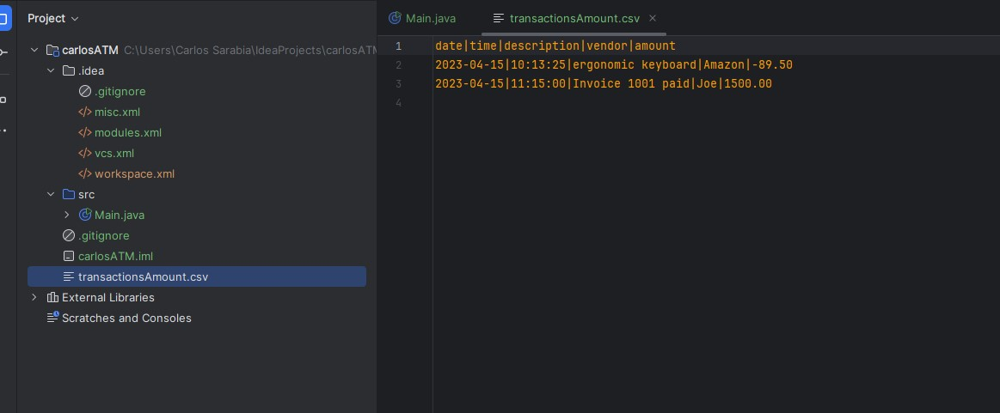
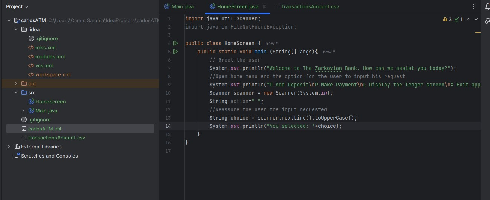
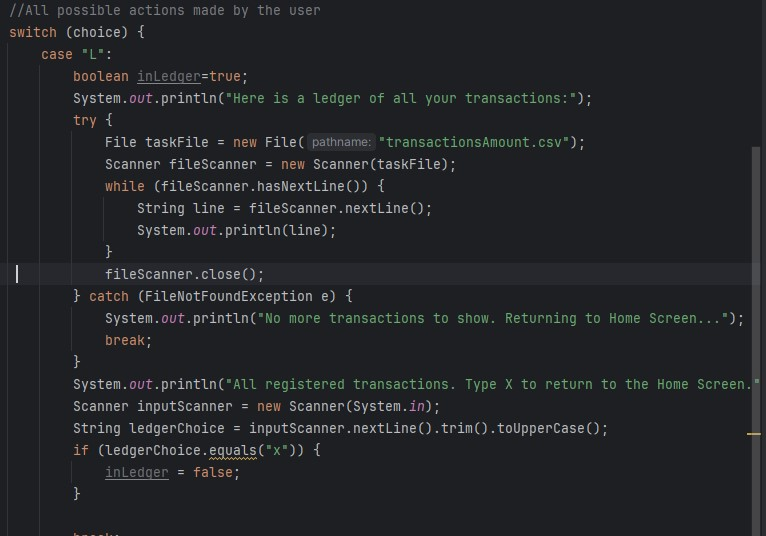
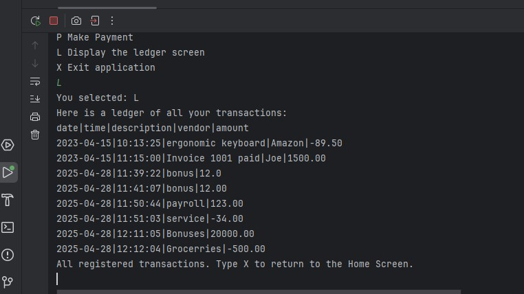
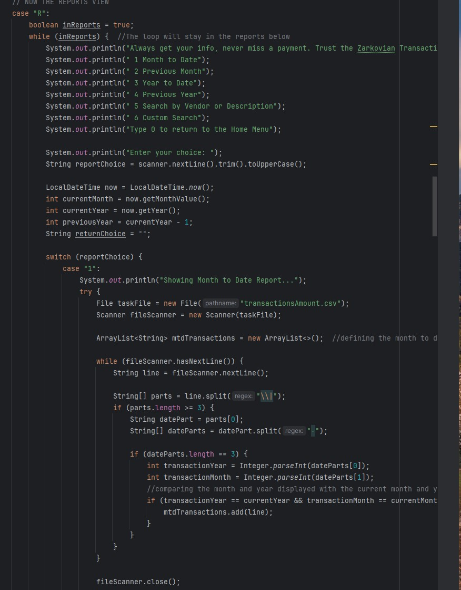
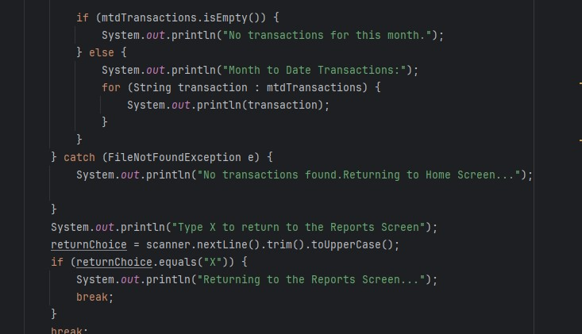
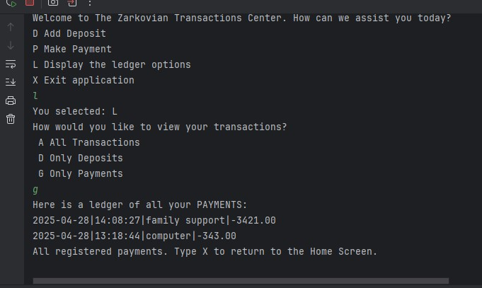

#My Project

This code simulates a bank ATM, with it, you will be presented with menus that guide you through the code. Inside the application you should be able to:
**Add a deposit** 
User can input any amount and the application will remember (The user will have to add a description or a vendor for the amount to save.
**Make a Payment**
User will input an amount he wants to pay and the application will remember it and save it as a negative amount. Same as the deposit
the user will have to add a description or the name of the vendor. 
**View Ledger Screen** 
User will be able to see al transaction history, it can be updated in real time. In addition, the user can search a specific transaction
with several tools that the application provides. 
**Exit the Application**
User will be able to exit the application at the Home screen. 

## Import the .Csv File

The first step is to include the transaction file on the src folder so the compiler understands that you want to add information to that specific space. 

## Greet the User with the Main Menu

Code that greets the User 

## Ledger View

The most complex part of the code was the several options you have to code so the user can have all available resources to search any transaction. 

## Reports

Inside the Ledger Menu, the user will find the reports where he or she can sort and organize the search in a way that is more efficient to find the transaction

## All Menus View
All the menus the user can go through

## Options to Return to the previous Screen
A way for a user to return to the previous page if needed. 

## Final Thoughts

It was a very enriching project, at first I was feeling a little bit overwhelmed with all the information we had to deliver to the user, but I started building it little by little
each bullet point at a time until I got entire blocks of working code. I enjoyed the project and it made mne feel accomplished. 
